# GitHub Classroom 

Front End -koulutuksen aikana tulee tehviä, joissa harjoitellaan ohjelmoinnin käsitteitä. Tehtävät suoritetaan GitHub Classroom -ympäristössä ja niihin vastaaminen tapahtuu normaalin GitHub-työkulun mukaisesti. 

> Tehtävän työkulku vo tuntua aluksi turhan monivaiheiselta, mutta kannattaa muistaa, että samalla tulee harjoiteltua Git-versiohallinnan ja GitHub-palvelun sujuvaa käyttöä.

## Tehtävään vastaaminen GitHubissa

Vastaaminen tapahtuu seuraavissa vaiheissa:

 - käyttöoikeuden myöntäminen GitHubille
 - tehtävän vastaanottaminen
 - tehtävän kopioiminen omalle koneelle (clone)
 - tehtävän avaaminen Visual Studio Codessa
 - muutosten tekeminen ja tallentaminen
 - ohjelman suorittaminen
 - testaaminen testausskriptillä
 - muutosten vieminen paikalliseen repoon (commit)
 - tehtävän palautus GitHubiin (push)
 
### Käyttöoikeuden myöntäminen GitHubille {-}

Ensimmäiseksi tehtävä vastaanotetaan klikkaamalla Moodlen kurssisivulla olevaa tehtävälinkkiä. Linkki vie sinut tehtävän GitHub Classroom -sivulle, jossa vastaanotat tehtävän.

Jos olet tekemässä tätä ensimmäistä kertaa, GitHub haluaa varmistaa, että haluat myöntää GitHub Classroom -sovellukselle oikeuden käyttää omaa GitHub-tiliäsi. Kirjaudu sisälle GitHub-tunnuksillasi, anna oikeudet painamalla **Authorize GitHub** -nappia ja klikkaa tämän jälkeen listasta omaa nimeäsi. Sivusto varmistaa vielä, että klikkasit varmasti omaa nimeäsi. Hyväksy valinta klikkaamalla **OK**. Jos et löydä nimeäsi listalta, niin klikkaa **Skip to the next step** -linkkiä. 

```{r, echo=FALSE, fig.cap="Käyttöoikeuden antaminen GitHubille"}
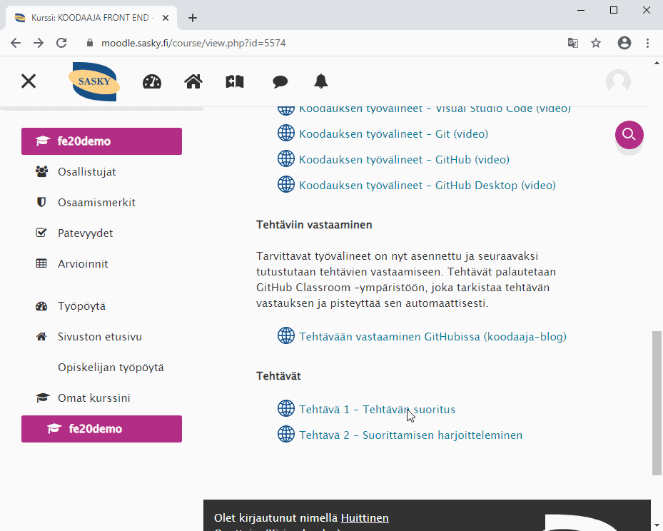
```

### Tehtävän vastaanottaminen {-}

Hyväksy tehtävä klikkaamalla **Accept this assignment** -nappia ja odota, että palvelu saa kopioitua tehtävän tiedot sinulle luotuun uuteen repoon. Klikkaa luonnin jälkeen repositoryn linkkiä, niin pääset tehtävän projektisivulle.

GitHub Classroom näkymä kopioinnin osalta on hieman muuttunut, mutta lopulta päädyt samanlaiselle sivulle, kuin animaatiossa.

```{r, echo=FALSE, fig.cap="Tehtävän vastaanottaminen"}
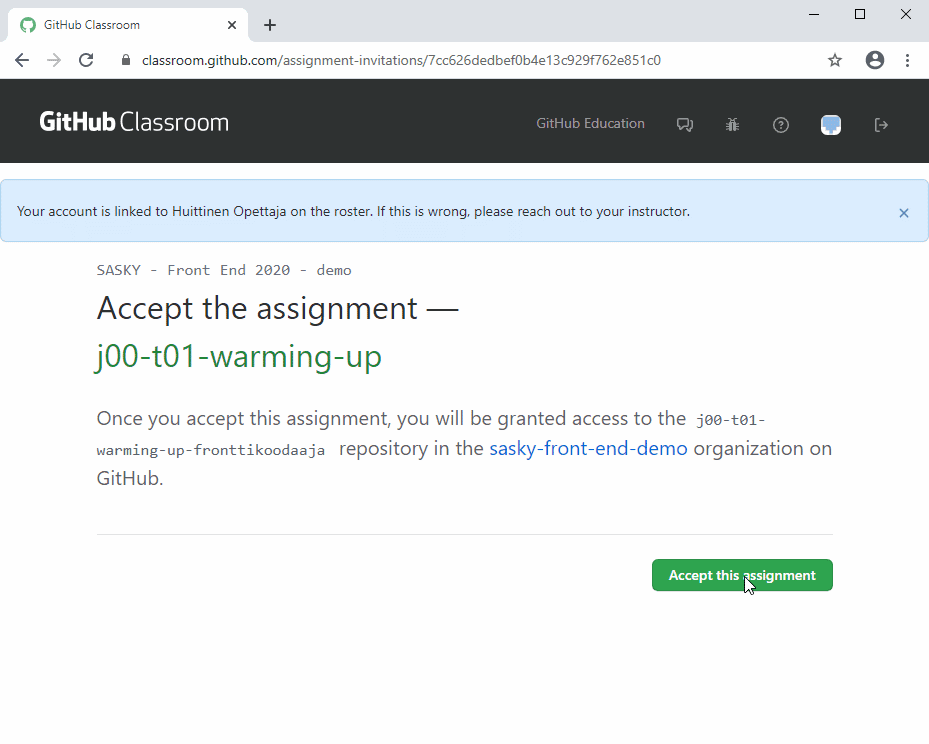
```

### Tehtävän kopioiminen omalle koneelle {-}

Ennen kuin tehtävän voi suorittaa, se kopioidaan omalle koneelle. Tämä tapahtuu klikkaamalla projektisivulla olevaa vihreää **Code**-nappia ja klikkaamalla avautuvasta ikkunasta osoitteen kopioiminen työpöydälle-kuvaketta.

Valitse tämän jälkeen GitHub Desktop -sovelluksessa **Clone a repository from the Internet** -kohta, avaa URL-välilehti ja liitä kopioimasi osoite *Repository URL* -kenttään. Varmista, että *Local path* -kentässä on oikea kansio valittuna.

Klikkaa **Clone**-nappia, jolloin tehtävän tiedot kopioidaan omalle koneellesi.

```{r, echo=FALSE, fig.cap="Tehtävän kopioiminen omalle koneelle"}
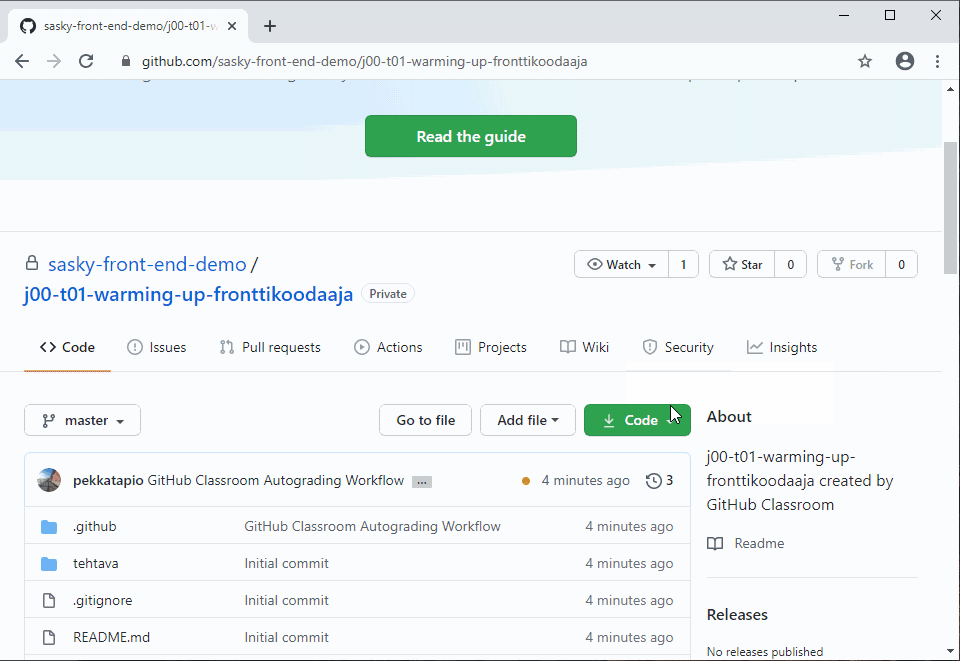
```

### Tehtävän avaaminen Visual Studio Codessa {-}

Avaa tehtävä Visual Studio Codessa valitsemalla **File** > **Open Folder…** Avautuvaan ikkunaan valitaan se kansio, jonne tehtävämateriaalit edellisessä vaiheessa kopioitiin. Valittu kansio hyväksytään klikkaamalla **Select Folder** -nappia.

Tämän jälkeen vasemmassa reunassa olevasta tiedostonäkymästä avataan *tehtava*-kansiosta löytyvä **tehtava.html** -tiedosto.

```{r, echo=FALSE, fig.cap="Tehtävän avaaminen Visual Studio Codessa"}
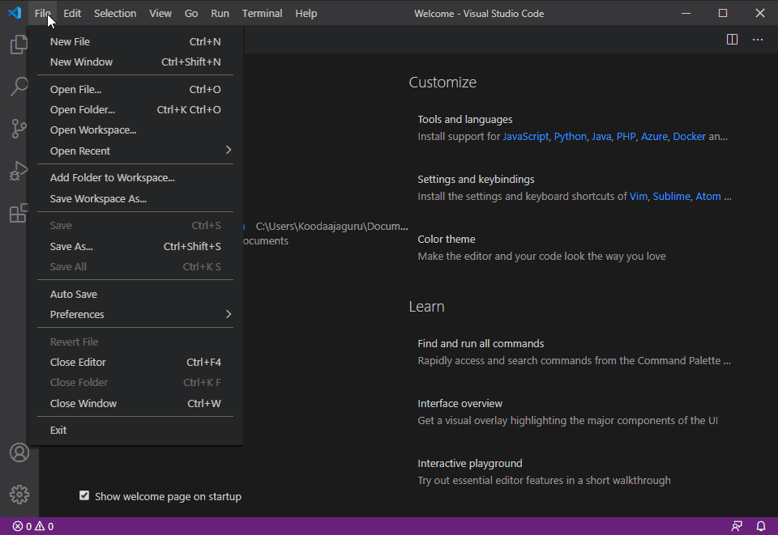
```

### Muutosten tekeminen ja tallentaminen {-}

Lue tehtävätiedostossa olevat ohjeet ja kirjoita tämän jälkeen ohjetekstin alapuolelle teksti *Hei Koodaajaguru, nyt aloitetaan koodaaminen!*.

Tallenna tekemäsi muutokset valitsemalla **File** > **Save**. Voit tallentaa muutokset myös pikanäppäimellä **Ctrl** + **S**.

```{r, echo=FALSE, fig.cap="Muutosten tekeminen ja tallentaminen"}
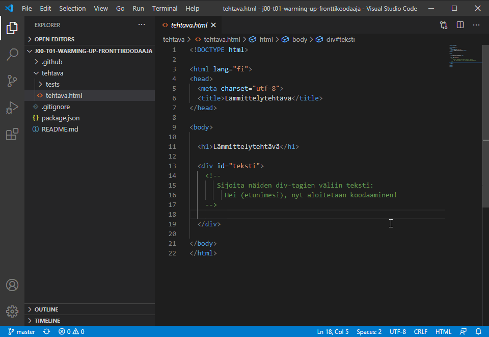
```

### Koodin suorittaminen {-}

Koodin tehdyt muutokset kannattaa testata tasaisin väliajoin. Harvemmin virheellinen koodi korjaantuu myöhemmissä vaiheissa taianomaisesti, vaan virheen syy kannattaa selvittää välittömästi.

HTML-sivulla olevan koodin pystyy testaamaan avaamalla sivun webbiselaimessa. Helpoiten tämä onnistuu tuplaklikkaamalla tiedostokuvakkeen päällä, jolloin tiedosto avautuu selaimeen.

```{r, echo=FALSE, fig.cap="Koodin suorittaminen"}
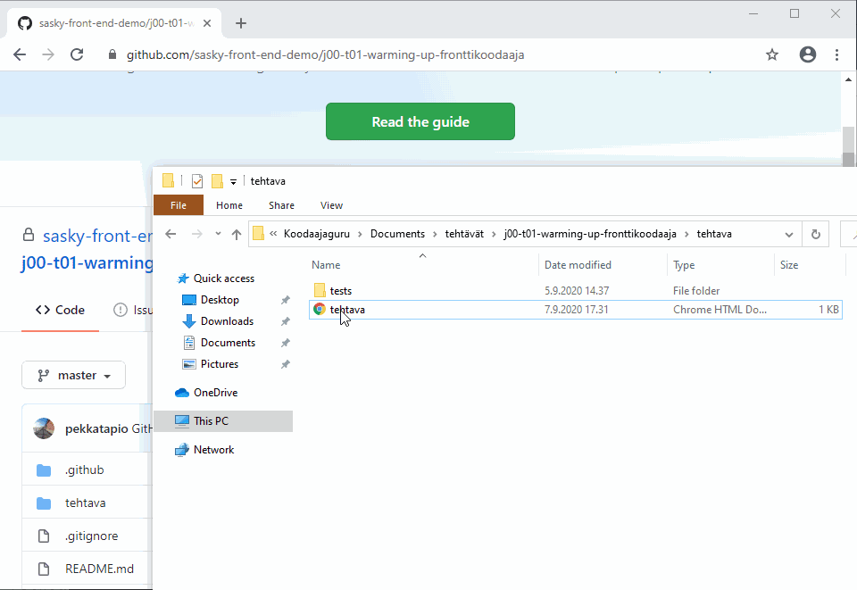
```

### Testaaminen testausskriptillä {-}

Tehtäviin on sisällytetty myös testausskripti, jolla vastauksen oikeellisuuden pystyy varmistamaan. Testausskripti suoritetaan valitsemalla **Terminal** > **New Terminal** ja antamalla avautuvaan terminaali-ikkunaan komento 

```
npm test
```

Jos ruudulle tulostuu vihreä *passed*-teksti, niin silloin tekemäsi muutokset läpäisivät testin. Tällöin voit palauttaa tehtäväsi vastauksen. Jos ruudulle tulostui punainen *failed* -teksti, niin silloin koodissasi on jokin virhe ja se täytyy korjata.

```{r, echo=FALSE, fig.cap="Testaaminen testausskriptillä"}
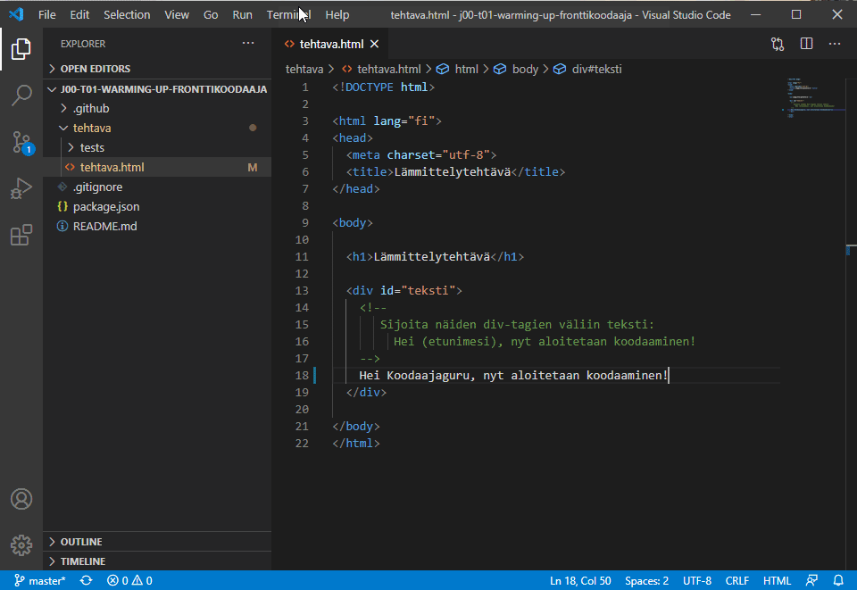
```

### Muutosten vieminen paikalliseen repoon {-}

Tehtävään tekemäsi muutokset täytyy viedä ensin paikallisessa projektikansiossa olevaan repoon ennen, kuin voit palauttaa tehtävän. Tätä toimipidettä kutsutaan *commitiksi*.

Aktivoi ensin **versiohallintanäkymä** Visual Studio Coden vasemman reunan palkista. Klikkaa *tehtava.html* -tiedoston oikealla puolella olevaa **+**-kuvaketta. Tämä merkitsee ko. tiedoston valituksi seuraavaan hyväksyntään (commitiin). Kirjoita tiedostoalueen yläpuolella olevaan tekstikenttään `Tehtävä suoritettu` ja klikkaa lopuksi **commit**-ikonia.

Tämän seurauksena tehtava.html-tiedostoon tekemäsi muutokset tallennettiin paikalliseen git-repoon committina. Nyt tekemäsi muutokset ovat valmiina palautukseen.

```{r, echo=FALSE, fig.cap="Muutosten vieminen paikalliseen repoon"}
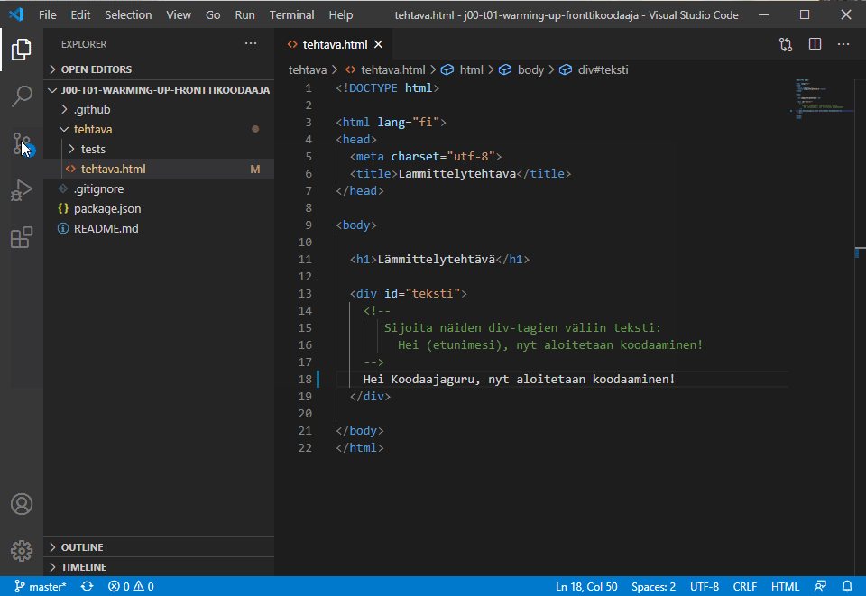
```

### Tehtävän palautus GitHubiin {-}

Viimeisenä vaiheena on paikallisten muutosten vieminen GitHubissa olevaan repoon, jolloin vastaus näkyy myös opettajalle. Tämä tapahtuu valitsemalla **…* > **pull, push** > **push**.

Voit tarkistaa palautuksen onnistumisen GitHubin projektisivulta. Sivulle pitäisi päivittyä commitissa antamasi tiedot sekä automaattitarkistuksen tulos. Automaattitarkistus tapahtuu taustaajona ja se vie muutaman minuutin.

Commit-riville tulostuu *vihreä väkänen*, jos palauttamasi koodi on hyväksytty. *Keltainen pallo* merkitsee, että testiä ollaan vielä suorittamassa. *Punainen ruksi* puolestaan ilmoittaa, että koodi ei läpäissyt testiä.

```{r, echo=FALSE, fig.cap="Tehtävän palautus GitHubiin"}
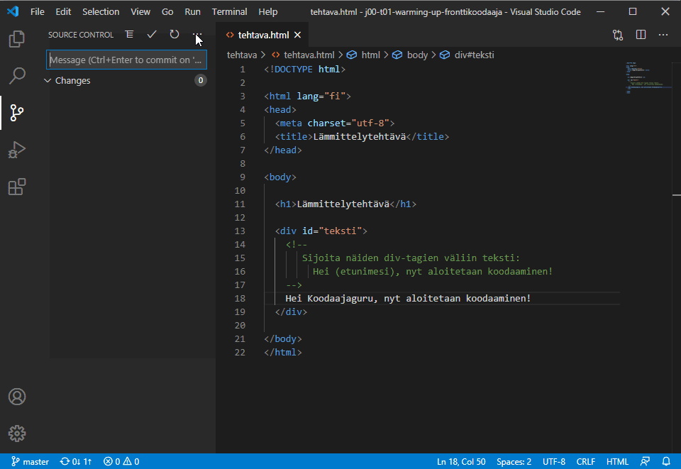
```

## Tehtävään vastaamisen pikaohje

Edellä kuvattiin tehtävään vastaaminen seikkaperäisesti vaihe vaiheelta. Jatkossa voit vastata tehtäviin seuraavan pikaohjeen mukaisesti.

 1. Vastaanota tehtävä klikkaamalla tehtävän linkkiä Moodlessa ja hyväksy tehtävä klikkaamalla **Accept this assignment** -nappia.
 
```{r, echo=FALSE, fig.cap="Tehtävän vastaanottaminen"}
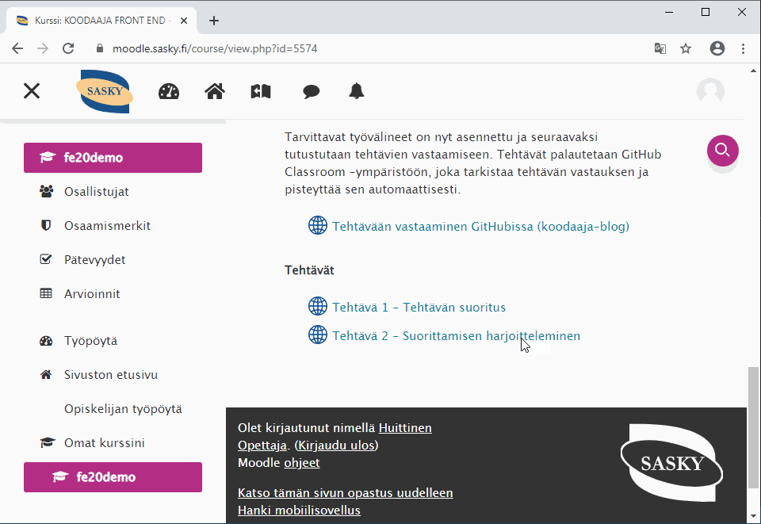
```

 2. Kopioi projekti omalle koneelle GitHub Desktop -sovelluksella.
 
```{r, echo=FALSE, fig.cap="Tehtävän kopioiminen"}
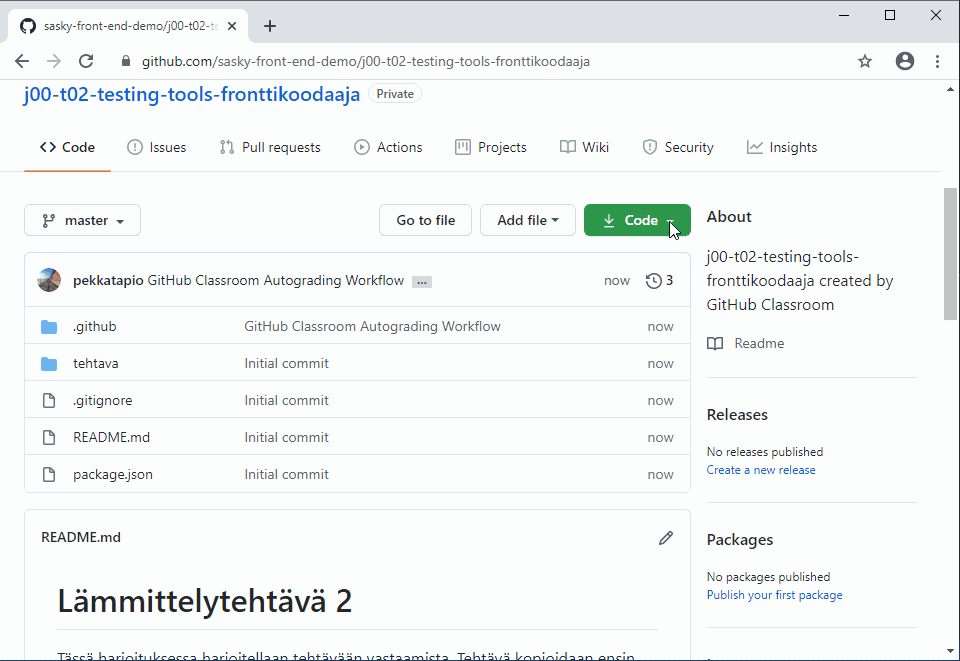
```

 3. Avaa tehtäväkansio Visual Studio Codessa, etsi *tehtava*-kansiosta tehtävätiedosto, tee pyydetyt muutokset ja tallenna.

```{r, echo=FALSE, fig.cap="Tehtävään vastaaminen"}
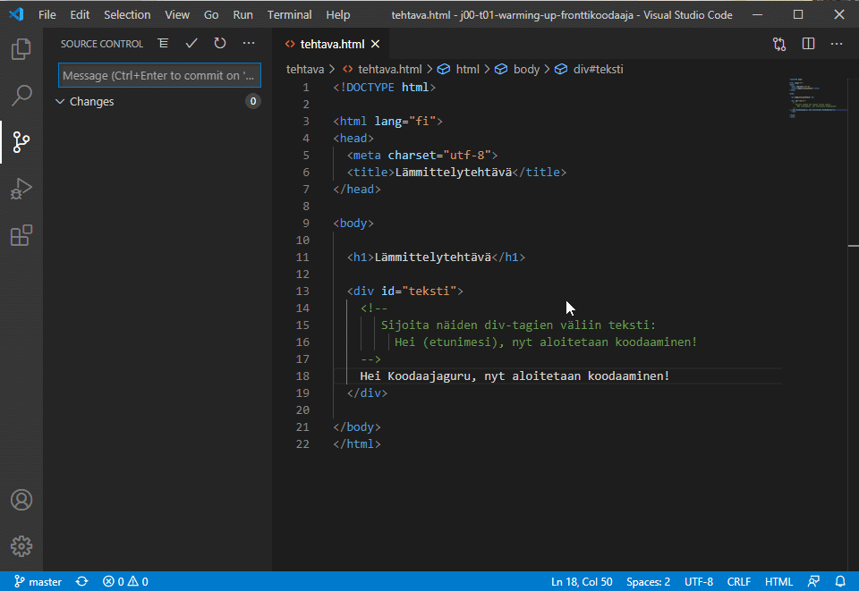
```

 4. Suorita koodi avaamalla HTML-sivu selaimessa tai suorittamalla Javascript-tiedosto komennolla 
 
    ```
    npm start
    ```

```{r, echo=FALSE, fig.cap="Koodin suorittaminen"}
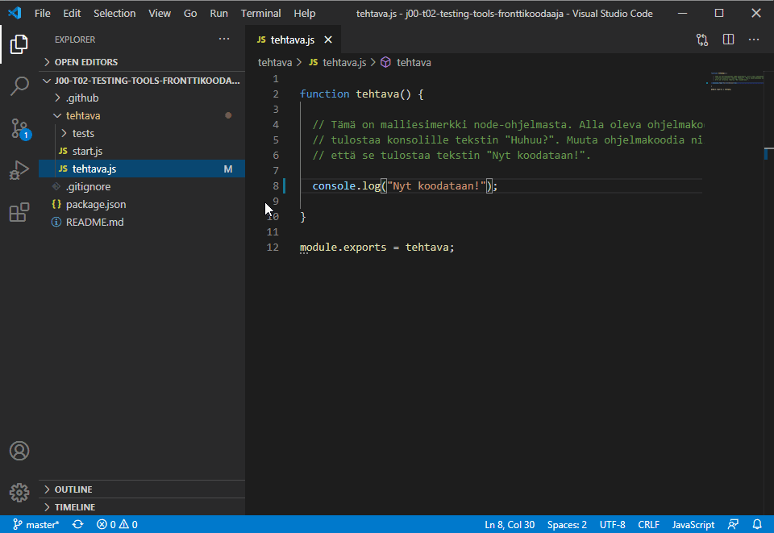
```

 5. Testaa vastauksesi oikeellisuus komennolla 
 
     ```
     npm test
     ```

```{r, echo=FALSE, fig.cap="Koodin testaaminen"}
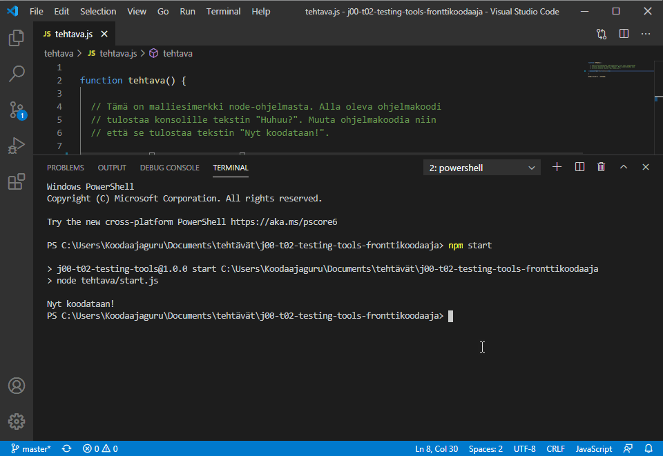
```    
    
  6. Vie tehtävän vastaus paikalliseen repoon commit -toiminnolla.
  
```{r, echo=FALSE, fig.cap="Vastauksen vieminen repoon"}
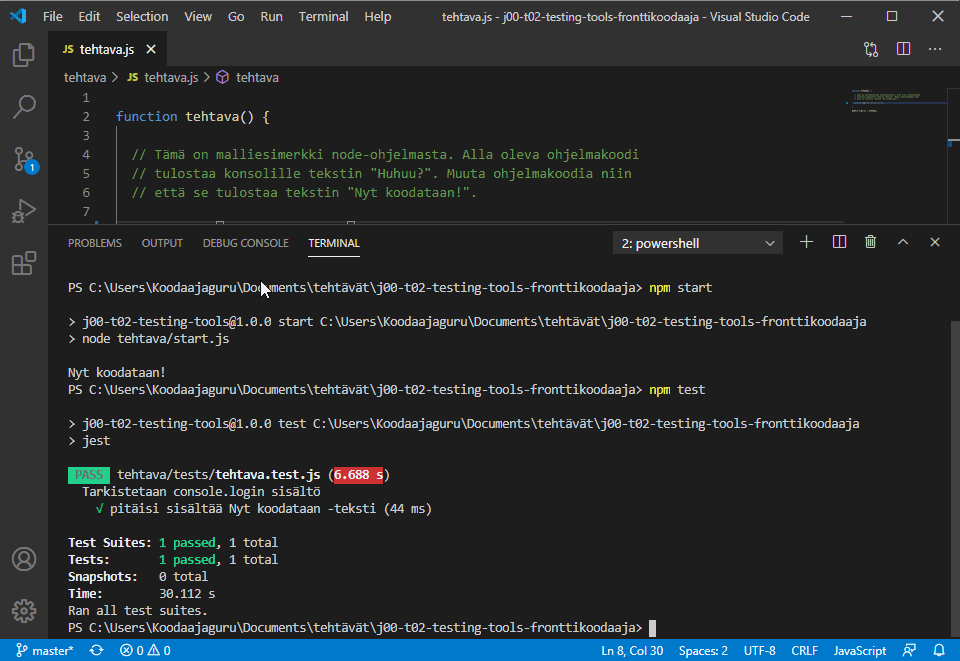
```

  7. Palauta tekemäsi vastaus GitHubin repoon push -toiminnolla.
  
```{r, echo=FALSE, fig.cap="Vastauksen palautus"}
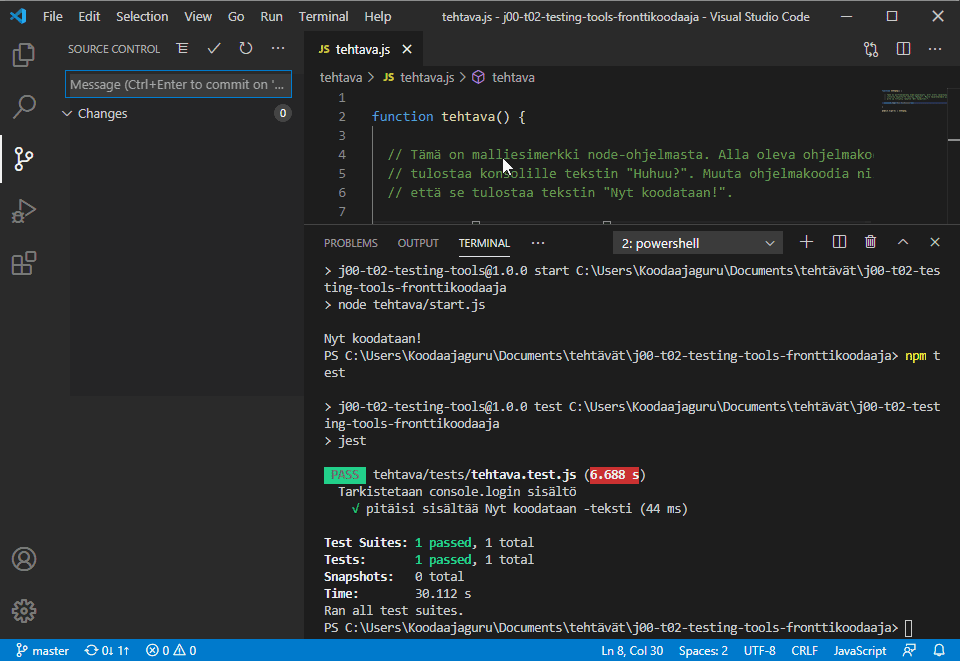
```  