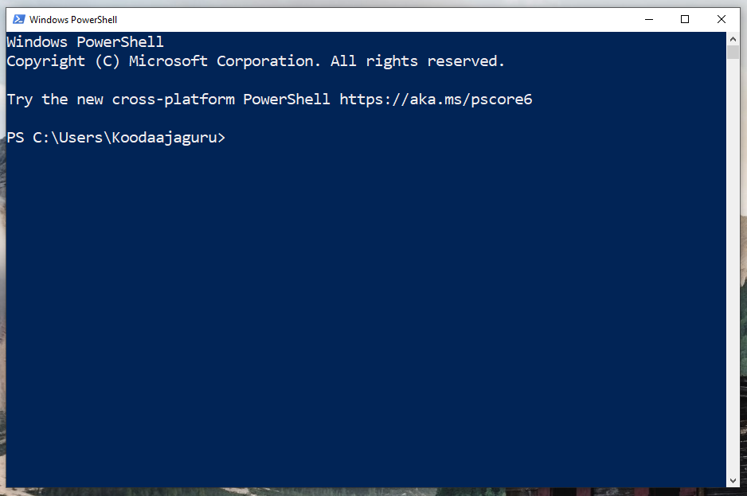
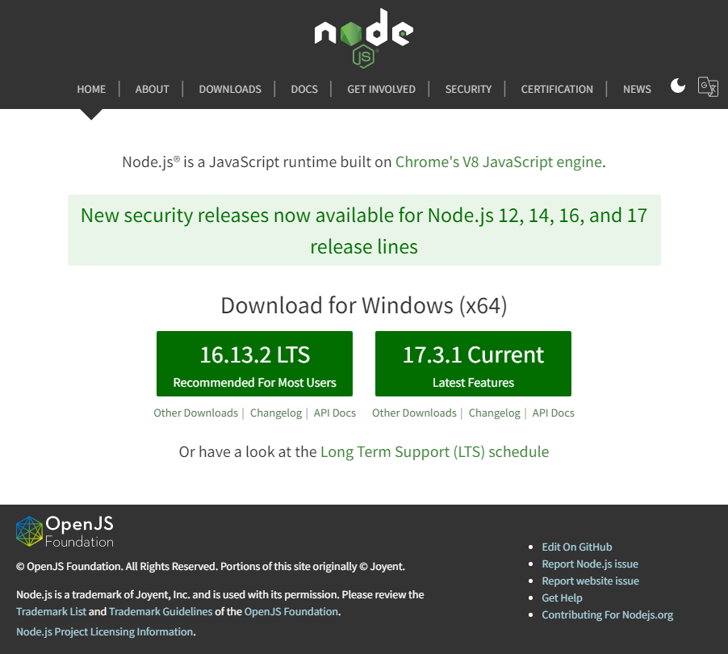
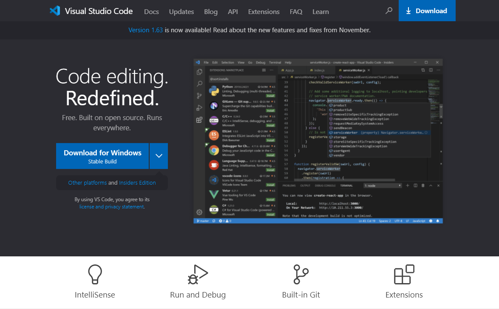

--- 
title: "Front End -sovelluksen toteutus"
author: "Pekka Tapio Aalto"
date: "`r Sys.Date()`"
url: https://github.com/sasky-koodaaja/frontend
github-repo: sasky-koodaaja/frontend
description: "Front End -sovelluksen toteutus Reactilla"
cover-image: "images/logo.png"
# Title page...
maintitlepage:
  epigraph: |
    Tämä kirja on toteutettu seuraavilla työvälineillä:
    \begin{itemize}
      \item \LaTeX  ja memoir-luokka (\url{http://www.ctan.org/pkg/memoir}).
      \item R (\url{http://www.r-project.org/}) ja RStudio (\url{http://www.rstudio.com/})
      \item bookdown (\url{http://bookdown.org/}) ja memoiR (\url{https://ericmarcon.github.io/memoiR/})
    \end{itemize}
  credits: |
    Pekka Tapio Aalto
    
    Huittisten ammatti- ja yrittäjäopisto
    
    SASKY koulutuskuntayhtymä
    
    \url{http://www.sasky.fi}
# ... or a PDF cover
pdftitlepage: images/cover.pdf
# Language
lang: finnish
otherlangs: []
# Bibliography
# bibliography: references.bib
# Citation style in HTML
# citation-style: chicago-author-date.csl # By default.
# LaTeX
documentclass: memoir
classoption:
  - extrafontsizes
  - onecolumn
  - openright
# Paper, font
papersize: A4
fontsize: 12pt
# Fonts installed by a package. LaTeX tex-gyre package must be installed for:
mainfont: texgyreheros          # Times New Roman for the text
mainfontoptions:
  - Extension=.otf
  - UprightFont=*-regular
  - BoldFont=*-bold
  - BoldItalicFont=*-bolditalic
  - ItalicFont=*-italic
# mathfont: texgyreadventor-math.otf # Times New Roman for equations
# memoir Style
MemoirChapStyle: daleif1           # or companion with large margins
MemoirPageStyle: Ruled             # or companion with large margins
# Margins
largemargins: false                # or true for large margins
smallmargin: 1.0in                 # outer margin (small).
largemargin: 3in                   # outer margin (large)
marginnote:  1.8in                 # note width in large margin
spinemargin: 1.5in                 # spine margin. Reduce to 1.2 with large margins.
uppermargin: 1.5in                 # upper margin
lowermargin: 1in                   # lower margin
# Table of contents
toc-depth: 2
# Section numbering
secnum-depth: section
# List of tables / Figures
lot: false
lof: false
# Bibliography
biblatexoptions:
  - backend=biber
  - style=authoryear-ibid  # or verbose-inote with large margins
# - pageref=true           # uncomment for verbose-inotes style
  - isbn=false
  - backref=true
  - giveninits=true
  - uniquename=init
  - maxcitenames=2
  - maxbibnames=150
  - sorting=nyt
  - sortcites=false
longbibliography: false    # if true, two columns and smaller font in PDF
# Chapter summary text
chaptersummary: Tiivistetysti
# Back Cover
backcover:
  - language: english
    abstract: |
      English abstract, on the last page.
  
      This is a bookdown template based on LaTeX memoir class.
    keywords:
      - Keyword in English
      - As a list
    abstractlabel: Abstract
    keywordlabel: Keywords
backcoverfontsize: normalsize
# Figure cropping may be set to false if ghostscript is not installed
fig_crop: true
fig_caption: false
# Do not modify
site: bookdown::bookdown_site
always_allow_html: true
graphics: true
link-citations: true
colorlinks: true
output:
  bookdown::gitbook:
    split_by: chapter
---

<!-- HTML code necessary for key messages --> 


```{r DoNotModify, include=FALSE}
### Utilities. Do not modify.
# Installation of packages if necessary
InstallPackages <- function(Packages) {
  InstallPackage <- function(Package) {
    if (!Package %in% installed.packages()[, 1]) {
      install.packages(Package, repos="https://cran.rstudio.com/")
    }
  }
  invisible(sapply(Packages, InstallPackage))
}

# Basic packages
InstallPackages(c("bookdown", "formatR", "kableExtra", "magick", "ragg"))

# kableExtra must be loaded 
if (knitr::opts_knit$get("rmarkdown.pandoc.to") == "docx") {
  # Word output (https://stackoverflow.com/questions/35144130/in-knitr-how-can-i-test-for-if-the-output-will-be-pdf-or-word)
  # Do not use autoformat (https://github.com/haozhu233/kableExtra/issues/308)
  options(kableExtra.auto_format = FALSE)
}
library("kableExtra")

# Chunk font size hook: allows size='small' or any valid Latex font size in chunk options
def.chunk.hook  <- knitr::knit_hooks$get("chunk")
knitr::knit_hooks$set(chunk = function(x, options) {
  x <- def.chunk.hook(x, options)
  ifelse(options$size != "normalsize", paste0("\n \\", options$size,"\n\n", x, "\n\n \\normalsize"), x)
})

# Figures with side captions
if (rmarkdown::metadata$largemargins)
  knitr::opts_chunk$set(fig.env='SCfigure')
```

```{r Options, include=FALSE}
### Customized options for this document
# Add necessary packages here
Packages <- c( "tidyverse")
# Install them
InstallPackages(Packages)
# Create packages.bib file to reference them as @R-package
knitr::write_bib(Packages, file="packages.bib")

# knitr options
knitr::opts_chunk$set(
  cache=FALSE, # Cache chunk results
  echo = TRUE, # Show/Hide R chunks
  warning=FALSE, # Show/Hide warnings
  messages=FALSE, # Show/Hide messages
  # Figure alignment and size
  fig.align='center', out.width='80%', fig.asp=.75,
  # Graphic devices (ragg_png is better than standard png)
  dev = c("ragg_png", "pdf"),
  # Code chunk format
  tidy=TRUE, tidy.opts=list(blank=FALSE, width.cutoff=60),
  size="scriptsize", knitr.graphics.auto_pdf = TRUE
  )
options(width=60)

# ggplot style
library("tidyverse")
theme_set(theme_bw())
theme_update(panel.background=element_rect(fill="transparent", colour=NA),
             plot.background=element_rect(fill="transparent", colour=NA))
knitr::opts_chunk$set(dev.args=list(bg="transparent"))

# Random seed
set.seed(973)
```


# Johdanto {-}

Tämä kirja on tarkoitettu ensisijaisesti KOODAAJA FRONT END -koulutuksen opiskelumateriaaliksi. Osa kirjassa käsitellyistä asioista on sidoksissa koulutuksen toteutustapaan ja se tekee tämän kirjan käyttämisen itseopiskelumateriaalina haasteelliseksi.  

<!-- The \mainmatter command marks the beginning of the LaTeX document body--> 
<!-- It must not be deleted-->
\mainmatter

<!--chapter:end:index.Rmd-->

---
output:
  pdf_document: default
  html_document: default
  bookdown::gitbook:
    split_by: section  
---
# Kehityksen työvälineet

Sujuvassa Front End -sovellusten kehityksessä tarvitaan melkoinen määrä erilaisia työkaluja, kuten esimerkiksi

  - komentorivi (PowerShell),
  - kehitysympäristön työkaluohjelmat (Node.js),
  - koodaamiseen soveltuva tekstieditori (Visual Studio Code),
  - lähdekoodin hallinta eli versiohallinta (Git).
  
Seuraavaksi asennamme nämä työvälineet yksi kerrallaan ja testaamme yksinkertaisella testillä, että niiden asennus on onnistunut.  

## Komentorivi

Ensimmäinen käyttöönotettava työväline on komentorivi. Ennen graafisia käyttöliittymiä tietokoneita käytettiin merkkipohjaisen komentorivin kautta. Sekä Front End että Back End -sovellusten kehityksessä on hyvä osata komentorivin perusteet. 

### Komentorivin käynnistäminen {-}

#### Windows {-}

Windowsissa komentoriviä voi käyttää useammalla tavalla. Komentokehote (Command Prompt) perustuu DOS-käyttöjärjestelmän toimintaan ja se on osana nykyistä Windowsia yhteensopivuussyistä. Alkuperäisen komentokehotteen korvaajaksi on kehitetty PowerShell, joka toi Windows-maailmaan Unix-ympäristöissä pitkään olleita ominaisuuksia. Tämän koulutuksen aikana käytämme PowerShelliä.
 
Helpoiten PowerShellin voi käynnistää kirjoittamalla Windowsin hakuikkunaan teksti **powershell** ja valitsemalla tarjotuista vaihtoehdoista **Windows Powershell**.
 
```{r, echo=FALSE, fig.cap="Powershellin käynnistäminen"}
knitr::include_graphics("kuvat/tyovalineet-powershell-kaynnistys.png")
```
   
Ruudulle avautuu pienen hetken päästä PowerShell-ikkuna, jossa vilkkuu kursori sen merkiksi, että sille voi syöttää suoritettava komento.
 
```{r, echo=FALSE, fig.cap="Powershell käynnistetty"}

```
   
Voit sulkea PowerShell-ikkunan, jota kutsutaan myös istunnoksi (session) joko klikkaamalla ikkunan oikeassa yläkulmassa olevaa rastia tai antamalla komento `exit`.

> Windowsissa voi käyttää myös Windows Terminal -sovellusta, joka löytyy ilmaiseksi Microsoft Storesta. Se tukee  välilehtiä ja sen kautta pystyy käynnistämään PowerShell-istunnon, komentokehotteen (Command Prompt) tai halutessaan sille voi määritellä SSH-yhteyden omaksi valinnakseen.

#### Mac {-}

Macissä on oma komentorivinsä, jonka voi käynnistää käynnistää klikkaamalla *LaunchPad*-ikonia, kirjoittamalla hakukenttään **Terminal** ja valitsemalla sen jälkeen **Terminal**. Lisäohjeita löydät Macin [käyttöohjeista](https://support.apple.com/guide/terminal/open-or-quit-terminal-apd5265185d-f365-44cb-8b09-71a064a42125/mac). 

#### Linux {-}

Jokaisesta Linuxista löytyy joku terminaali, haasteellisempaa on löytää se, miten se käynnistetään, koska käynnistäminen vaihtelee jakeluversiosta ja käytettävästä graafisesta ympäristöstä riippuen. Tyypillisesti se löytyy syöttämällä hakusanoiksi *terminal*, *command*, *prompt* tai *shell*. Useimmissa järjestelmissä komentorivi on nimeltään Terminal tai xterm. Monissa jakeluversiossa toimii myös pikanäppäinyhdistelmä *Ctrl+Alt+T*. Lisäohjeita löydät mm. Ubuntun [käyttöohjeista](https://ubuntu.com/tutorials/command-line-for-beginners#3-opening-a-terminal).
  
### Komentorivin käyttäminen {-}

#### Kansiorakenteessa liikkuminen {-}

Riippumatta siitä, mitä käyttöjärjestelmää käytät, on komentorivin peruskäyttö hyvin samanlaista. Aivan ensimmäiseksi kannattaa opetella liikkumaan hakemistorakenteen sisällä. Lähtökohtaisesti komennolla `dir` saat listattua nykyisessä kansiossa olevat tiedostot ja hakemistot. Esimerkiksi Windowsissa komennon tulos näyttäisi seuraavanlaiselta:

```
PS C:\Users\Koodaajaguru> dir

    Directory: C:\Users\Koodaajaguru

Mode                 LastWriteTime         Length Name
----                 -------------         ------ ----
d-r---          1.9.2020      7.16                3D Objects
d-r---          1.9.2020      7.16                Contacts
d-r---          9.3.2021     13.40                Desktop
d-r---          7.4.2021     14.34                Documents
d-r---          7.4.2021     14.34                Downloads
...
d-r---          1.9.2020      7.16                Searches
d-r---          5.9.2020     13.24                Videos
-a----          1.9.2020     12.26            293 .gitconfig
```

Edellisessä listauksessa kaikki d-kirjaimella alkavat rivit (d-r---) ovat hakemistoja ja loput ovat tavallisia tiedostoja. Alihakemistoon pystyt siirtymään `cd`-komennolla. Esimerkiksi Windowsissa voit siirtyä käyttäjän Tiedostot-kansioon (Documents) komennolla

```
cd Documents
```

Tämän seurauksena komentokehoite muuttuu niin, että se ilmaisee uuden sijainnin. 

> Windows on hieman kieroutunut kansion nimien suhteen. Jos tätä kansiota katsotaan Resurssienhallinnan kautta, niin se näkyy suomenkielisessä Windowsissa suomennettuna eli nimellä Tiedostot. Todellisuudessa tämä kansio levytasolla on nimellä Documents ja tätä alkuperäistä nimeä on käytettävä komentorivillä siihen viitattaessa.

```
PS C:\Users\Koodaajaguru\Documents>
```

Macissä ja Linuxissa voit kokeilla siirtymistä mihin tahansa omassa tiedostolistauksessasi olevaan kansioon. Hakemistopuussa liikkuminen on turvallista, se ei sekoita tietokonetta. 

Kansiossa, johon edellisessä vaiheessa siirryit, voit tehdä jälleen samat toiminnot eli listata kansiossa olevat tiedostot komennolla `dir` ja siirtymällä kansiossa olevaan alikansioon komennolla `cd alikansio`.

Välillä tulee tilanne, että olisi tarve siirtyä yhtä kansiota ylemmäs. Tämä onnistuu helpoiten komennolla 

```
cd ..
```

Tämän seurauksena käyttäjä on siirtynyt kansiotasoa ylemmäs eli malliesimerkissä takaisin `C:\Users\Koodaajaguru` -kansioon.

Kahdella pisteellä on oma erityismerkityksensä hakemistopoluissa. Se viittaa aina kansion ns. äitikansioon eli siihen pääkansioon, jonka alla kansio sijaitsee. Kansion ja sen alikansion voi niputtaa yhteen käyttämällä erottimena hakemistoerotinta eli /-merkkiä. Esimerkiksi komento `cd ../..` siirtyisi `C:\Users\Koodaajaguru\Documents` -kansiosta `C:\Users`-kansioon eli kahta kansiotasoa ylemmäs. Vastaavasti komento `cd ../Downloads`siirtyisi `C:\Users\Koodaajaguru\Documents` -kansiosta `C:\Users\Koodaajaguru\Downloads`-kansioon eli käyttäjän Lautaukset-kansioon.

Jos olet eksynyt hakemistopuuhun ja haluat palata takaisin käyttäjän kotikansioon, niin se onnistuu helpoiten komennolla 

```
cd ~
```

#### Alikansion luominen {-}

Sen lisäksi, että osaat liikkua kansiorakenteessa, saatat joutua luomaan uusia alikansiota. Tämäkin tapahtuu peruspiirteissään samalla tavalla riippumatta siitä, että käytätkö Windowsia, Linuxia tai macOsia. Uusi alikansio luodaan `mkdir`-komennolla, joka on lyhenne sanoista *make directory*. 

Seuraavaksi luomme kotihakemistoon alikansion, jonne keräämme koulutuksen aikana toteutettavat projektit.

##### Windows {-}

Siirrytään ensin käyttäjän Tiedostot-kansioon komennolla

```
cd ~/Documents
```

ja luodaan Tiedostot-kansioon uusi *projektit*-niminen alikansio komennolla

```
mkdir projektit
```

Jatkossa pääset seuraavalla komennolla projektit-kansioon, aina kun käynnistät PowerShellin uudestaan.

```
cd ~/Documents/projektit
```

##### Linux ja macOS {-}

Unix-pohjaissa käyttöjärjestelmissä kotikansiomalli on erilainen kuin Windowsissa. Tästä johtuen luomme projektit-kansion käyttäjän kotikansion alle. Siirrytään ensin käyttäjän kotikansioon komennolla

```
cd ~
```

ja luodaan uusi *projektit*-niminen alikansio komennolla

``` 
mkdir projektit
```

Jatkossa pääset seuraavalla komennolla projektit-kansioon, aina kun käynnistät komentorivin.

```
cd ~/projektit
```

> Voit halutessasi nimetä projektit-kansion jollain toisella nimellä, mutta muista käyttää tätä antamaasi nimeä  jatkossa, kun materiaalissa käytetään projektit-kansiota.

Edellä on todellisuudessa aivan pieni pintaraapaisu siitä, mitä komentorivillä voi tehdä. Tässä vaiheessa riittää, että osaat liikkua hakemistopuussa ylös- ja alaspäin sekä osaat luoda uusia alikansiota. Samoja asioita käsitellään myös [Koodauksen työvälineet - Komentorivi](https://www.youtube.com/watch?v=SMqcepv0zqE) -videossa.

## Node.js

Toinen jatkossa paljonkin käytettävä työväline on *Node.js*-ympäristö. Se on ajoympäristö, joka mahdollistaa JavaScriptillä toteutettujen ohjelmien suorittamisen omalla koneella. Node.js on ladattavissa yleisimmille käyttöjärjestelmille. Toisin sanoen sille löytyy valmiit asennuspaketit Windowsille, Linuxille ja macOSille.

### Node.js:n asennus {-}

 1. Mene selaimella osoitteeseen [https://nodejs.org/en/](https://nodejs.org/en/).
 
```{r, echo=FALSE, fig.cap="Node.js-sivusto"}

```
   
 2. Klikkaa **Current**-vaihtoehtoa, se on uusin ja viimeisin käännetty Node.js-versio. LTS-vaihtoehto on vakaampi versio, joka on ensisijaisesti tarkoitettu tuotantokäyttöön tai tilanteisiin, jossa uusimman version ominaisuuksia ei ole vielä tuettu.
 
    Sivusto tunnistaa automaattisesti käyttämäsi käyttöjärjestelmän ja tarjoaa sitä vastaavaa asennuspakettia. Jos näin ei kuitenkaan tapahdu, niin klikkaa silloin sivun yläreunasta Downloads-valinta ja valitse sieltä käyttöjärjestelmääsi vastaava asennuspaketti.
    
 3. Käynnistä lataamasi asennuspaketti tuplaklikkaamalla sitä. Seuraavat ohjeet noudattavat Windows-paketin asennusvaiheita, jos asennat ympäristöä toiselle käyttöjärjestelmälle, niin asennuksen kulku on silloin erilainen.
     - Klikkaa *Welcome to Node.js Setup Wizard* -näkymässä **Next**.
     - Hyväksy *End-User License Agreement* -näkymässä lisenssi valitsemalla **I accept the terms in the License Agreement** ja klikkaa **Next**.
     - Hyväksy tarjottu asennuskansio *Destination Folder* -näkymässä klikkaamalla **Next**.
     - Hyväksy asennettavat paketit *Custom Setup* -näkymässä klikkaamalla **Next**.
     - Tässä koulutuksessa ei ole tarvetta kääntää moduuleita, joten *Tool for Native Modules* -näkymässä ei tehdä tarjottua valintaa, vaan klikataan ainoastaan **Next**.
     - Hyväksy lopulta *Ready to install Node.js* -näkymässä Node.js-ympäristön asennus tekemilläsi valinnoilla klikkaamalla **Install**. Asennusohjelma kysyy pääkäyttäjän oikeuksia, jotka sinun tulee myöntää.
     - Asennusohjelma asentaa kaikki tarvittavat tiedostot sekä määrittelee polkuasetuksen. Lopulta asennusohjelma päättyy *Completed the Node.js Setup Wizard* -näkymään, jossa voit klikata **Finish** päättääksesi asennusohjelman.
     
     
 4. Windowsin Node.js hyödyntää taustalla PowerShell-skriptejä, joiden suorittaminen on oletusarvoisesti estetty. Jotta nämä skriptit toimivat ongelmitta, on sinun tehtävä seuraava määrittely koneellesi PowerShellin kautta:
 
    ```
    Set-ExecutionPolicy -Scope CurrentUser RemoteSigned
    ```
    
    Tämä komento sallii paikallisten PowerShell-skriptien suorittamisen käyttäjällä, jolla olet kirjautunut sisälle. Ladatut skriptit vaativat jatkossa ns. allekirjoituksen. Komento varmistaa vielä, että olet tietoinen muutoksen sivuvaikutuksista. Vastaa tähän kysymykseen **Y** eli **Yes**.
    
    Komennon suorituksen jälkeen komentorivi näyttää seuraavanlaiselta:
    
    ```
    PS C:\Users\Koodaajaguru> Set-ExecutionPolicy -Scope CurrentUser RemoteSigned

    Execution Policy Change
    The execution policy helps protect you from scripts that you do not trust. Changing the 
    execution policy might expose you to the security risks described in the 
    about_Execution_Policies help topic at
    https:/go.microsoft.com/fwlink/?LinkID=135170. Do you want to change the execution policy?
    [Y] Yes  [A] Yes to All  [N] No  [L] No to All  [S] Suspend  [?] Help (default is "N"): Y
    ```
 
 
### Asennuksen onnistumisen tarkistaminen {-} 

Seuraavaksi tarkistetaan, että Node.js-ympäristö toimii niin, että voimme sitä jatkossa käyttää. Tulosta asennetun Node.js:n versionumero komennolla

```
node -v
```

Tämä komento tulostaa asennetun ympäristön versionumeron, tässä materiaalissa asennetulla versiolla tulostuu 

```
v17.3.1
```
Asentamasi versio on todennäköisesti eri. Oleellista on, että komento tulostaa versionumeron, joka on sama tai uudempi kuin esimerkissä. Tarkistetaan myös, että npm-pakettihallinta on asentunut oikein syöttämällä komento

```
npm -v
```

Komento tulostaa asennetun npm-sovelluksen versionumeron, joka on materiaalin asennuspaketilla

```
8.3.0
```

Tässäkin tapauksessa versionumero voi poiketa. Oleellista on, että versionumero on sama tai uudempi kuin esimerkissä.

Nämä samat asiat käsitellään myös [Koodauksen työvälineet - Node.js](https://www.youtube.com/watch?v=bFELPMx68m8) -videossa sillä erolla, että videossa asennetaan vanhempi versio Node.js-ympäristöstä.

## npm

Node.js-ympäristön mukana asennettiin *npm*-niminen sovellus, jolla voi asentaa, päivittää ja poistaa npm-kirjastossa julkaistuja paketteja. npm tulee sanoista Node Package Management ja sen kirjasto sisältää uskomattoman määrän eri käyttötarkoituksiin toteutettuja JavaScript-sovelluksia, jotka auttavat joko sovelluskehityksessä, ylläpidossa tai niitä voi hyödyntää osana omaa sovellusta. 

### Suoritus ilman asentamista {-}

npm-pakettien suorittaminen vaatii, että niiden sovelluskoodit löytyvät suorittavalta koneelta. Aikaisemmin tämä vaati paketin asentamista, uusimmissa versiossa suorittaminen onnistuu ilman asentamista erillisellä *npx*-ohjelmalla. Taustalla npx käy lataamassa väliaikaisesti tarvittavat koodit, suorittaa sen ja sen jälkeen poistaa suoritukseen ladatut koodit. 

Esimerkiksi seuraava komento käy lataamassa cowsay-nimisen npm-paketin, suorittaa sen antamalla sen syötteeksi komentorivin lopussa olevan tekstin ja poistaa lopuksi ladatut (ja väliaikaisesti) asennetut tiedostot.

```
npm cowsay "Nyt lähtee homma käsistä!"
```

Komento tuottaa seuraavan tulostuksen. Mahdolliseen varmistusviestiin voi vastata **y**.  

```
Need to install the following packages:
  cowsay
Ok to proceed? (y) y
 ___________________________
< Nyt lähtee homma käsistä! >
 ---------------------------
        \   ^__^
         \  (oo)\_______
            (__)\       )\/\
                ||----w |
                ||     ||
```

Kuten tulosteesta voi päätellä, cowsay-paketista on loppujen lopuksi varsin vähän todellista hyötyä. npx-komennolla kannattaa ajaa harvoin tarvittavia paketteja, tällöin paketin asennus ei vie turhaa levytilaa ja ajettaessa käytetään aina uusinta versiota paketista.

### Paketin asentaminen globaalisti {-}

npm-pakettien iso haittapuoli on niiden tarvitsema levytila. Yksittäisessä projektissa sillä ei ole juuri merkitystä, mutta tilantarve kertautuu tilanteissa, jossa samaa sovellusta tarvitaan useammassa projektissa. Tämänkaltaisissa tilanteissa npm-paketin voi asentaa ns. globaalisti eli niin, että se on käytettävissä missä tahansa kansiossa. Huomaa kuitenkin, että globaali asennus on käyttäjäkohtainen, se ei tee npm-paketin asennusta näkyväksi kaikille koneen käyttäjille.

Tämän koulutuksen aikana tulemme hyödyntämään tehtävien tarkistuksessa automaattista tarkistusta. Käytännössä tämä tarkoittaa sitä, että tehtävän vastaus ajetaan tarkistustestien lävitse. Jotta voit jatkossa testata, että meneekö tekemäsi tehtävä testistä läbvitse, niin kannattaa levytilan kulutuksen vähentämiseksi asentaa tehtävissä käytettävät testauspaketit globaalisti.

### TestCafe-paketin asennus {-}

TestCafe on testausympäristö, jolla voi testata HTML-sivun toimintaa. Lisätietoja paketista löydät [paketin kuvauksesta](https://www.npmjs.com/package/testcafe). Asennetaan *testcafe*-paketti globaalisti komennolla

```
npm install -g testcafe
```

Komentorivillä `install` kertoo, että asennetaan uusi paketti, `-g` ilmaisee, että paketti asennetaan globaalisti ja `testcafe` on asennettavan paketin nimi. Komennon suoritus kestää jonkin aikaa ja ruudulle saattaa tulostua *npm WARN*-alkuisia varoitusrivejä. Asennusvaiheessa tulevat varotukset ovat ihan normaaleita, ne eivät estä sovelluksen asentumista ja suorittamista. Kun sovellus on asentunut, tulostuu ruudulle lopuksi seuraavankaltainen teksti:

```
added 462 packages, and audited 463 packages in 57s

26 packages are looking for funding
  run `npm fund` for details

found 0 vulnerabilities
```

Voit testata, että tescafe tuli asennettua ja se käynnistyy komennolla 

```
testcafe -v
```

Jos ruudulle tulostuu testcafen versionumero, on kaikki kunnossa.

```
1.18.1
```

### Jest-paketin asennus {-}

Jest on erityisesti JavaScriptin testaukseen soveltuva testausympäristö. Lisätietoja Jestistä löydät sen [kotisivuilta](https://jestjs.io). Asennetaan samalla tavalla jest-paketti globaalisti komennolla

```
npm install -g jest
```

Asennuksen jälkeen tulostuu seuraavankaltaiset tekstit ilmaisemaan asennuksen onnistumista.

```
added 323 packages, and audited 324 packages in 14s

26 packages are looking for funding
  run `npm fund` for details

found 0 vulnerabilities
```

Asennusta voi testata suorittamalla komento

```
jest -v
```

Jos tulokseksi tuli jestin versionumero, niin asennus onnistui.

```
27.4.7
```

npm-sovelluksen käyttö ja testauspakettien asennus käsitellään myös [Koodauksen työvälineet - npm](https://www.youtube.com/watch?v=ACkLEQ7QZH4) -videossa.


## Visual Studio Code

Koodauksen yksi tärkeimmistä työkaluista on tekstieditori, jolla muokataan lähdekoodeja ja muita tekstitiedostoja. Periaatteessa tähän tarkoitukseen kelpaa melkein mikä tahansa tekstieditori, hätätilanteessa Windowsin Muistio toimii peruseditointiin. Jotta ohjelmakoodin kirjoittaminen olisi tehokasta ja tuottavaa, kannattaa käyttöön ottaa koodaamiseen erityisesti suunniteltu tekstieditori. 

Tässä materiaalissa käytetään Visual Studio Code -nimistä tekstieditoria, pääosin seuraavista syistä:

 - Se on vapaan lähdekoodin projekti, toisin sanoen se on ilmainen.
 - Sille löytyy valmiit asennuspaketit Windowsille, Linuxille ja macOs:lle.
 - Se on kooltaan maltillinen ja se käynnistyy kohtuullisen nopeasti.
 - Sille löytyy uskomaton määrä erilaisia lisäosia, joilla sen toiminnallisuutta pystyy laajentamaan.
 - Siihen on sisäänrakennettu tuki Git-versiohallinnalle.
 - Se on käytetyin tekstieditori Front End -kehityksessä.
 
Halutessasi voit käyttää mitä tahansa muuta editoria, kuten esimerkiksi:

 - [Atom](https://atom.io) (ilmainen)
 - [Sublime Text](https://www.sublimetext.com) (maksullinen, kokeilujaksoa ei rajoitettu)
 - [WebStorm](https://www.jetbrains.com/webstorm/) (maksullinen, opiskelijana mahdollisuus käyttää ilmaiseksi)
 
### Visual Studio Coden asentaminen {-}

 1. Mene selaimella osoitteeseen [https://code.visualstudio.com](https://code.visualstudio.com).
 
```{r, echo=FALSE, fig.cap="Visual Studio Code-sivusto"}

```
 
 2. Klikkaa **Download for Windows**-nappia. Sivusto tunnistaa automaattisesti käyttämäsi käyttöjärjestelmän ja tarjoaa sitä vastaavaa asennuspakettia. Jos näin ei kuitenkaan tapahdu, niin klikkaa silloin sivun yläreunasta Downloads-linkkiä ja valitse sieltä käyttöjärjestelmääsi vastaava asennuspaketti.
    
 3. Käynnistä lataamasi asennuspaketti tuplaklikkaamalla sitä. Seuraavat ohjeet noudattavat Windows-paketin asennusvaiheita, jos asennat ympäristöä toiselle käyttöjärjestelmälle, niin asennuksen kulku on silloin erilainen.
     - Hyväksy *License Agreement* -näkymässä lisenssi valitsemalla **I accept the agreement** ja klikkaa **Next**.
     - Valitse *Select Additional Tasks*-näkymässä ne valinnat, jotka haluat ottaa käyttöön. Alla on suositeltavat valinnat:
     
        

       Voit valita myös kohdan **Register Code as an editor for Supported file types**, jos et käytä aktiivisesti jotain toista tekstieditoria koodien ja muiden tekstitiedostojen muokkaamiseen.
     - Käynnistä *Ready to Install* -näkymässä asennus klikkaamalla **Install**.
     - Asennusohjelma asentaa kaikki tarvittavat tiedostot sekä määrittelee polkuasetuksen. Lopulta asennusohjelma päättyy *Completing the Visual Studio Code Setup Wizard* -näkymään, jossa voit klikata **Finish** päättääksesi asennusohjelman. Asennusohjelma käynnistää oletuksena viimeisenä vaiheena juuri asennetun Visual Studio Coden.

```{r, echo=FALSE, fig.cap="Visual Studio Code"}
knitr::include_graphics("kuvat/tyovalineet-vsc-kaytto.png")
```

### Visual Studio Coden testaaminen {-}

Visual Studio Code perustuu toiminta-ajatukseen, että projektia työstettäessä ei muokata projektin yksittäistä tiedostoa vaan muokkauksen alla on projektikansio ja sen alla olevat tiedostot. Tällöin Visual Studio Code tietää minkä projektin versiohallintaa sen tulisi seurata.

Projektikansion avaaminen käsittelyyn tapahtuu klikkaamalla aloitusnäytöllä olevaa **Open Folder...**-linkkiä tai valitsemalla valikosta **File** > **Open Folder...**. Voit tällä kertaa valita avattavaksi kansioksi käyttäjän *Tiedostot*-kansion alta löytyvä **projektit**-kansio. 

> Muista seuraavalla kerralla avata nimenomainen projektikansio, jota haluat käsitellä. Päädyt ennen pitkää ongelmiin, jos sinulla on projektit-kansion alla useampi projekti joita työstät ja muokkaat kaikkia niin, että olet avannut Visual Studio Codessa projektit-kansion, etkä nimenomaista työn alla olevaa projektikansiota. 

Kansion avaamisen yhteydessä VSC saattaa varmistaa, että luotatko kansion sisällä olevien tiedostojen sisältöihin. Jos kansio sisältää sinun itsesi tai luotettavan tahon tuottamaa sisältöä, voit valita vaihtoehdon **Yes, I trust the authors**. Valitse toinen vaihtoehto, jos sinulla ei ole täyttä varmuutta koodin sisällöstä tai lähteestä.

```{r, echo=FALSE, fig.cap="Varmistus kansion sisällön luottamiseen"}
knitr::include_graphics("kuvat/tyovalineet-vsc-kaytto-2.png")
```

Visual Studio Code -sovelluksen asennus ja peruskäyttö on kerrottu myös [Koodauksen työvälineet - Visual Studio Code](https://www.youtube.com/watch?v=C5nV4DVagf8) -videossa.

## Git

Seuraava asennettava työkalu on Git-versiohallinta. Git on lähtökohtaisesti komentorivipohjainen työkalu, mutta esimerkiksi Visual Studio Code mahdollistaa Gitin käyttämisen graafisella käyttöliittymällä. Visual Studio Coden puolella Gitin ominaisuudet ovat käytettävissä heti, kun Gitin peruspaketti on asennettu järjestelmään.

### Gitin asentaminen {-}

  1. Mene selaimella osoitteeseen [https://git-scm.com](https://git-scm.com).
 
```{r, echo=FALSE, fig.cap="Git-versiohallinnan kotisivut"}
knitr::include_graphics("kuvat/tyovalineet-git-asennus.png")
```

 2. Klikkaa **Download for Windows**-nappia. Sivusto tunnistaa automaattisesti käyttämäsi käyttöjärjestelmän ja tarjoaa sitä vastaavan asennustavan. Jos näin ei kuitenkaan tapahdu, niin klikkaa silloin sivulta löytyvää Downloads-linkkiä ja valitse sieltä käyttöjärjestelmääsi vastaava asennustapa.
 
    Valitse avautuvalta sivulta **Click here to download**-linkkiä, jolloin saat ladattua koneellesi asennuspaketin.
 
 3. Käynnistä lataamasi asennuspaketti tuplaklikkaamalla sitä. Seuraavat ohjeet noudattavat Windows-paketin asennusvaiheita, jos asennat ympäristöä toiselle käyttöjärjestelmälle, niin asennuksen kulku on silloin erilainen.
     - Hyväksy *Information* -näkymässä oleva lisenssi valitsemalla **Next**.
     - Klikkaa *Select Destination Location*-näkymässä **Next**.
     - Klikkaa *Select Components*-näkymässä **Next**.
     - Klikkaa *Select Start Menu Folder*-näkymässä **Next**.
     - Valitse *Choosing the default editor user by Git*-näkymän listasta vaihtoehto **Use Visual Studio Code as Git's default editor** ja jatka klikkaamalla **Next**.
     - Klikkaa *Adjusting the name of the initial branch in new repositories*-näkymässä **Next**.
     - Klikkaa *Adjusting your PATH environment*-näkymässä **Next**.
     - Klikkaa *Choosing the SSH executable*-näkymässä **Next**.
     - Klikkaa *Choosing HTTPS transport backend*-näkymässä **Next**.
     - Klikkaa *Configuring the line ending conversions*-näkymässä **Next**.
     - Klikkaa *Configuring the terminal emulator to use with Git Bash*-näkymässä **Next**.
     - Klikkaa *Choose the default behaviour of 'git pull'*-näkymässä **Next**.
     - Klikkaa *Choose a credential helper*-näkymässä **Next**.
     - Klikkaa *Configuring extra options*-näkymässä **Next**.
     - Aloita asennus *Configuring experimental options*-näkymässä klikkaamalla **Install**. 
     - Asennusohjelma asentaa kaikki tarvittavat tiedostot sekä määrittelee asetukset. Lopulta asennusohjelma päättyy *Completing the Git Setup Wizard* -näkymään, jossa voit klikata **Finish** päättääksesi asennusohjelman.


 4. Testaa Gitin asennuksen onnistuminen antamalla komentoriville komento
  
    ```
    git --version
    ```
    
    Asennus onnistui, jos komento tulostaa sinulle asennetun Gitin versionumeron:
    
    ```
    git version 2.34.1.windows.1
    ```
    
Gitin asentaminen on kuvattu myös Pro Git -kirjan [Getting Started - Installing Git](https://git-scm.com/book/en/v2/Getting-Started-Installing-Git) -luvussa.    
    
### Gitin alkuasetukset {-} 

Jotta Gitiä voidaan ottaa käyttöön, on sille määriteltävä kaksi asetusta komentorivin kautta. Määritetään ensin käyttäjän nimi suorittamalla komentorivillä seuraava komento. Korvaa nimen paikalle oma nimesi.

```
git config --global user.name "Koodaajaguru"
```

Nimen lisäksi täytyy määritellä myös käyttäjän sähköpostiosoite.  Nimi ja sähköpostiosoite tulee näkymään Git-repon hyväksytyissä commit-taltioinneissa. Määrittele sähköpostiosoite komennolla. Korvaa komentoon oma sähköpostiosoitteesi.

```
git config --global user.email koodaajaguru@gmail.com
```

Gitin alkuasetusten määrittelyä on selostettu Pro Git -kirjan [Getting Started - First-Time Git Setup](https://git-scm.com/book/en/v2/Getting-Started-First-Time-Git-Setup) -luvussa.

Git -versiohallinnan asennus ja asetukset on kerrottu myös [Koodauksen työvälineet - Git](https://www.youtube.com/watch?v=cXF59q6jWT0) -videossa.


<!--chapter:end:01-tyovalineet.Rmd-->

